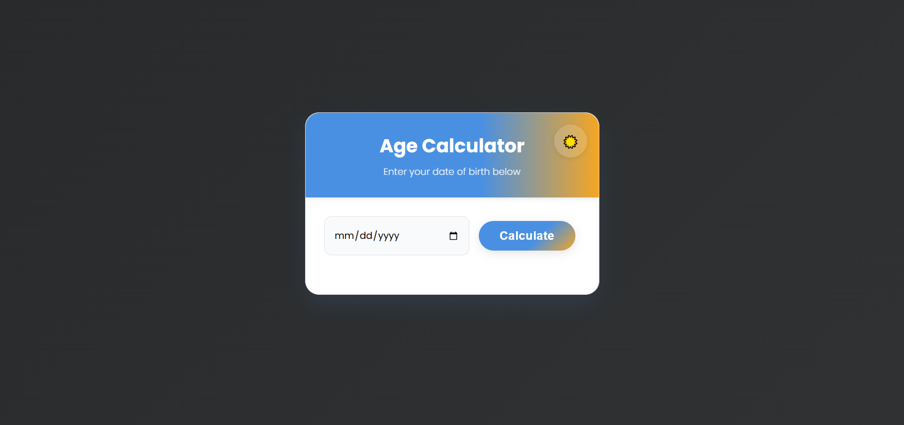

# 🧮 Age Calculator

A modern, responsive, and feature-rich Age Calculator web app. Enter your date of birth and instantly see your age in years, months, days, and more—plus fun facts, milestones, and shareable cards!

---

## 🚀 Features

- 🎨 **Modern UI** — Beautiful, animated gradient background and stylish card design
- 🌗 **Light & Dark Mode** — Toggle themes instantly
- 📱 **Fully Responsive** — Looks and works great on phones, tablets, and desktops
- 🧑‍🎤 **Fun Facts Zone** — Zodiac sign, Chinese zodiac, historical events, celebrity birthdays, numerology, and more
- 🏆 **Milestones** — See your next big age milestones
- 📤 **Share & Save** — Share your results or save birthdays for friends and family
- 💾 **Local Storage** — Saved birthdays persist between visits
- ♿ **Accessible** — Keyboard navigation, tooltips, and screen reader support

---

## 📸 Screenshots

---

## 🛠️ How to Use

1. Enter your date of birth and click **Calculate**.
2. Explore your age details, fun facts, and share or save results!

---

## 🎨 Customization

- **Colors & Styles:** Edit `style.css` for your own color palette or button styles.
- **Fun Facts:** Expand the lists in `script.js` for more events, celebrities, or facts.
- **Features:** The code is modular and easy to extend!

---

## ♿ Accessibility

- All interactive elements are keyboard accessible.
- Tooltips and visually hidden labels for screen readers.
- High-contrast dark mode for low-light environments.

---

## 🙏 Credits

- Emojis from the Unicode standard
- Designed and coded by [beshoy]

---

## 📄 License

This project is open source and free to use under the MIT License. 